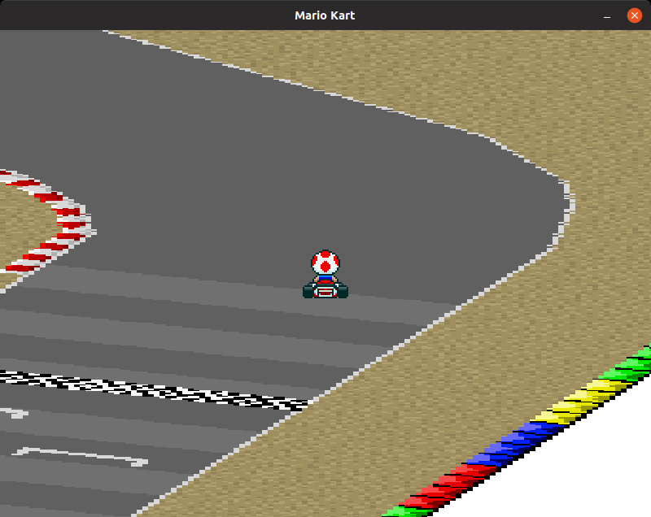

# pygame-mode7-kart


controls
--------

WSDA

or

left / right:  rotate the images
up / down   :  adjust the tilt of the image
z / x       :  adjust the zoom of the image

have fun


Install
```
pip3 install -r requirements.txt 
```

Run
```
python3 kart.py
```

Format
```
pip3 install yapf
yapf -i *.py
```


